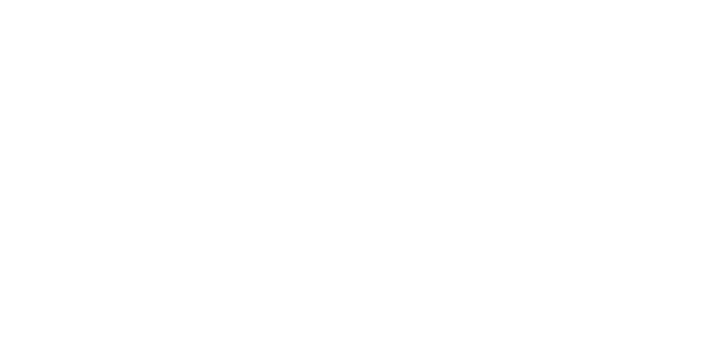
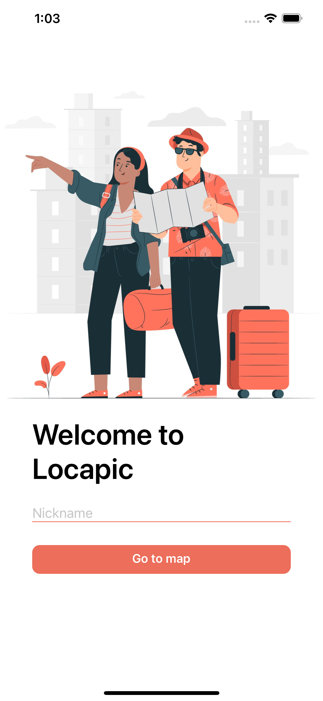
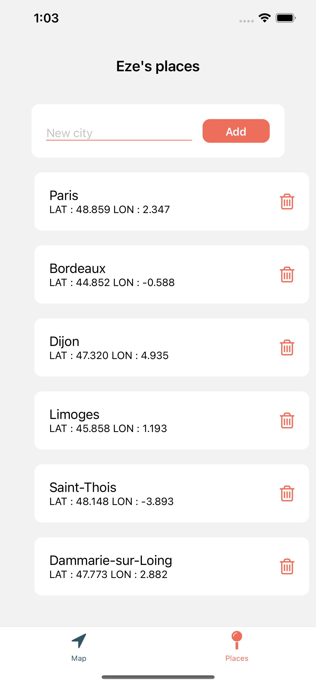

<div id="" align="center">
  
</div>

# Locapic

Locapic est une application mobile qui vous permet de vous géolocaliser et d'ajouter vos villes favorites sur la carte du monde, puis de les enregistrer 

# Technologie utilisée

- react-native
- expo
- react-redux 

# Prérequis 

Pour tester l'applications il vous faut :

- un iphone ou un android
- Installez l'application Expo Go sur votre téléphone avec app store ou play store
<div id="" align="start">
  
    
    
</div>

# Tester l'applications en ligne

1. Si vous avez un android, scannez le Qr code android
2. Si vous avez un iphone, scannez le Qr code iphone

<div id="" align="start">
<div style="display: flex; justify-content: space-around; width:80%"><h4>Android QR code<h4> <h4>Iphone QR code<h4></div>
  
    
</div>


# Installation et test local


Exécutez ces lignes de commande dans votre terminal sur votre ordinateur
`````bash
git clone https://github.com/ezeflt/locapic.git
cd locapic/frontend
yarn install
yarn start
`````

Vous devriez voir ceci
<div id="" align="start">
  
</div>


- Si vous avez un iphone, scannez le Qr code iphone
- Si vous avez un android, scannez le Qr code android
- Si vous êtes sur MacOS pressez la touche i pour ouvrir un émulateur d'iphone
- Si vous êtes sur Window pressez la touche a pour ouvrir un émulateur d'android
</br></br>

## Présentation de l'application

|page d'accueil|minuteur page|page d'ajout d'alarme
|-----------|--------------|-----------|
<div id="" align="start">
  
  
  
</div>
<div id="" align="center">
  
</div>

# Développeur 

Ezechiel Felten </br>

feltenezechiel1@gmail.com</br>
[linkedin](https://www.linkedin.com/in/ezechiel-felten-475693248/)</br>
[portfolio](https://ezechiel-app.vercel.app/)</br>
